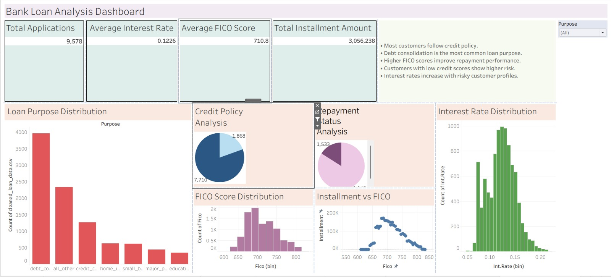

# Bank Loan Analysis

## Project Overview
This project analyzes bank loan data to understand customer repayment behavior, credit policy impact, loan purposes, and interest rate patterns using Python and Tableau.

---

## Objectives
- Analyze loan application trends
- Study repayment status
- Identify customer risk patterns
- Explore credit policy impact
- Visualize loan distributions and KPIs
- Build an interactive Tableau dashboard

---

## Technologies Used
- Python
- Pandas
- NumPy
- Matplotlib
- Seaborn
- Tableau

---

## KPI Metrics
- Total Applications
- Average Interest Rate
- Average FICO Score
- Total Installment Amount

---

## Dashboard Visualizations
- Loan Purpose Distribution
- Credit Policy Analysis
- Repayment Status Analysis
- FICO Score Distribution
- Installment vs FICO
- Interest Rate Distribution

---

## Key Insights
- Most customers follow the credit policy.
- Debt consolidation is the most common loan purpose.
- Higher FICO scores improve repayment performance.
- Low credit score customers show higher risk.
- Interest rates increase with risky customer profiles.

---

## Dashboard Preview

---

## Conclusion
The project provides valuable insights into customer loan behavior, repayment risks, and credit analysis using interactive visualizations and business intelligence techniques.